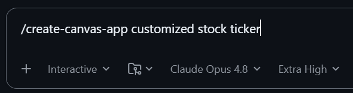
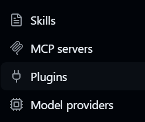
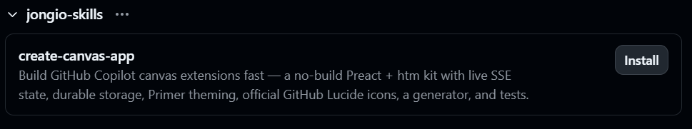
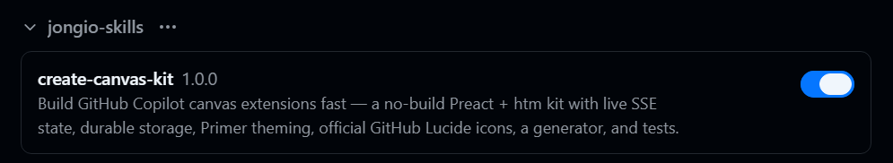

# jongio/skills

[](https://skills.sh/jongio/skills)

Jon Gallant's collection of skills for AI coding agents — works with
[GitHub Copilot](https://docs.github.com/copilot), Claude, Codex, and any agent
that supports the [`SKILL.md`](https://github.com/vercel-labs/skills) format. A
general-purpose monorepo: each skill lives in its own folder under
[`skills/`](skills/) and can be installed individually or all at once.

## Skills

| Skill | What it does |
|---|---|
| [`create-canvas-app`](skills/create-canvas-app/) | Build GitHub Copilot App canvas extensions fast — a no-build Preact + htm kit with live SSE state, durable storage, Primer theming, official GitHub Lucide icons, deep links into the app, a generator, and an installable skill. |
| [`create-gh-pages-site`](skills/create-gh-pages-site/) | Scaffold a working GitHub Pages site from a vetted template (static, Astro, React + Vite, Eleventy, or Jekyll) into your current repo by default — injects the correct base path for the target repo, wires the official GitHub Actions Pages deploy workflow, sets the repo's Website link, and shows how to enable Pages. |
| [`repo-ready`](skills/repo-ready/) | Scaffold and maintain the standard community health files every GitHub repository needs (.gitignore, LICENSE, CONTRIBUTING, issue templates, CI workflows, dependabot, and more). Two modes: init (interview + scaffold) and update (scan for gaps). |

A skill is invoked straight from the Copilot composer &mdash; here `create-canvas-app`
turns a one-line prompt into a working canvas:



## Install

Uses the [`vercel-labs/skills`](https://github.com/vercel-labs/skills) CLI
(`skills.sh`) — note the binary is **`skills`** (plural).

```sh
# List the skills available in this repo:
npx skills add jongio/skills --list

# Install one skill globally for GitHub Copilot:
npx skills add jongio/skills --skill create-canvas-app -g --agent github-copilot

# Install into the current project instead of globally (drop -g):
npx skills add jongio/skills --skill create-canvas-app

# Install every skill in the repo:
npx skills add jongio/skills --all

# Pin to a branch or tag:
npx skills add jongio/skills#main --skill create-canvas-app
```

After any install, reload skills with `/skills reload` or start a new session.
Each skill is then available as `/<skill-name>` (e.g. `/create-canvas-app`).

### Add as a marketplace, or install as a plugin

`jongio/skills` also plugs into the GitHub Copilot **plugin** system (works in both
the Copilot app and the [Copilot CLI](https://docs.github.com/copilot/how-tos/copilot-cli)).
There are two ways to use it.

**Add it as a marketplace** — browse and install individual skills. The repo ships a
root [`marketplace.json`](marketplace.json) that indexes its skills:

```sh
# Register the marketplace:
copilot plugin marketplace add jongio/skills

# See what's available:
copilot plugin marketplace browse jongio-skills

# Install one skill from it (form: <plugin>@<marketplace>):
copilot plugin install create-canvas-app@jongio-skills
```

**In the Copilot app** — no commands needed:

1. Open **Settings** and select **Plugins**.

   

2. Click **Install &#9662; &rarr; Add marketplace**, enter `jongio/skills`, and click **Add marketplace**.

   

3. The marketplace's skills appear grouped under **jongio-skills** &mdash; click **Install** on the one you want.

   

4. The skill installs and is enabled, ready to use right away.

   

**Or install the whole repo as a single plugin** — gets every skill under `skills/`
at once (uses the root [`plugin.json`](plugin.json)):

```sh
copilot plugin install jongio/skills
```

## Layout

```
marketplace.json             Copilot marketplace manifest (indexes skills as plugins)
plugin.json                   Copilot plugin manifest (skills: "skills/")
skills/
  create-canvas-app/          One self-contained skill
    SKILL.md                  Authoring contract the agent reads
    README.md                 Human docs for the skill
    kit/  reference/  scripts/  test/  docs/
```

Add a new skill by creating `skills/<name>/SKILL.md` (plus any bundled assets in
the same folder); the `skills` CLI auto-discovers it.

## License

MIT — see [LICENSE](LICENSE).
