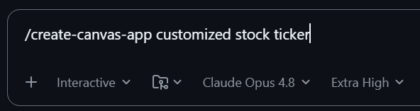
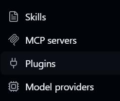
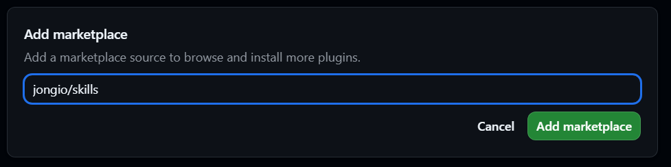
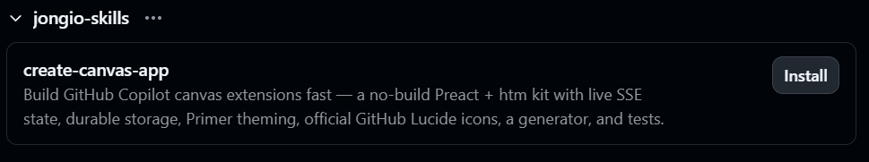
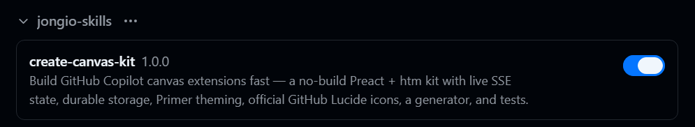

# jongio/skills

[](https://skills.sh/jongio/skills)

Jon Gallant's collection of skills for AI coding agents — works with
[GitHub Copilot](https://docs.github.com/copilot), Claude, Codex, and any agent
that supports the [`SKILL.md`](https://github.com/vercel-labs/skills) format. A
general-purpose monorepo: each skill lives in its own folder under
[`skills/`](skills/) and can be installed individually or all at once.

## Skills

| Skill | What it does |
|---|---|
| [`create-canvas-app`](skills/create-canvas-app/) | Build GitHub Copilot App canvas extensions fast — a no-build Preact + htm kit with live SSE state, durable storage, Primer theming, official GitHub Lucide icons, deep links into the app, a generator, and an installable skill. |
| [`create-gh-pages-site`](skills/create-gh-pages-site/) | Scaffold a working GitHub Pages site from a vetted template (static, Astro, React + Vite, Eleventy, or Jekyll) into your current repo by default — injects the correct base path for the target repo, wires the official GitHub Actions Pages deploy workflow, sets the repo's Website link, and shows how to enable Pages. |
| [`repo-ready`](skills/repo-ready/) | Scaffold and maintain the standard community health files every GitHub repository needs (.gitignore, LICENSE, CONTRIBUTING, issue templates, CI workflows, dependabot, and more). Two modes: init (interview + scaffold) and update (scan for gaps). |
| [`naming-is-hard`](skills/naming-is-hard/) | Interactive naming assistant for projects, CLIs, and products. Profiles what you're building, generates diverse candidate names, learns your preferences as you react, and validates finalists against real availability (domains, GitHub, npm/PyPI/crates/RubyGems/NuGet, social handles) plus a trademark and existing-business screen. Every finalist lands a verdict: Deal Breaker, It's Complicated, or Perfect Match. |
| [`eli5`](skills/eli5/) | Explain the code, error, design, or idea already in context using plain language, a useful analogy, the proper grown-up terms, and an honest note about where the analogy stops working. |
| [`dns-doctor`](skills/dns-doctor/) | Audit DNS delegation, records, DNSSEC, CAA, web routing, TLS, CDN behavior, mail authentication, takeover exposure, and zone hygiene, then apply exact provider changes only after explicit user approval. |
| [`deps-doctor`](skills/deps-doctor/) | Audit, update, and secure dependencies across npm, pnpm, Yarn, pip, Poetry, uv, Go, Cargo, Bundler, Composer, NuGet, Maven, Gradle, Swift, pub, and Hex, plus Docker base images, GitHub Actions, Terraform, and dev container features. Ranks vulnerabilities by exploitation evidence, withholds releases too new to have been vetted, fixes breaking changes forward instead of rolling back, and never opens an empty dependency pull request. |
| [`git-tidy`](skills/git-tidy/) | Comprehensive git repo hygiene in one pass: branches, worktrees, stashes, tags, remotes, merge artifacts, ignored-but-tracked files, large history blobs, and maintenance health. Classifies every finding by confidence (safe, review, keep) and deletes nothing without explicit approval. |

A skill is invoked straight from the Copilot composer &mdash; here `create-canvas-app`
turns a one-line prompt into a working canvas:



## Install

Uses the [`vercel-labs/skills`](https://github.com/vercel-labs/skills) CLI
(`skills.sh`) — note the binary is **`skills`** (plural).

```sh
# List the skills available in this repo:
npx skills add jongio/skills --list

# Install one skill globally for GitHub Copilot:
npx skills add jongio/skills --skill create-canvas-app -g --agent github-copilot

# Install into the current project instead of globally (drop -g):
npx skills add jongio/skills --skill create-canvas-app

# Install every skill in the repo:
npx skills add jongio/skills --all

# Pin to a branch or tag:
npx skills add jongio/skills#main --skill create-canvas-app
```

After any install, reload skills with `/skills reload` or start a new session.
Each skill is then available as `/<skill-name>` (e.g. `/create-canvas-app`).

### Add as a marketplace, or install as a plugin

`jongio/skills` also plugs into the GitHub Copilot **plugin** system (works in both
the Copilot app and the [Copilot CLI](https://docs.github.com/copilot/how-tos/copilot-cli)).
There are two ways to use it.

**Add it as a marketplace** — browse and install individual skills. The repo ships a
root [`marketplace.json`](marketplace.json) that indexes its skills:

```sh
# Register the marketplace:
copilot plugin marketplace add jongio/skills

# See what's available:
copilot plugin marketplace browse jongio-skills

# Install one skill from it (form: <plugin>@<marketplace>):
copilot plugin install create-canvas-app@jongio-skills
```

**In the Copilot app** — no commands needed:

1. Open **Settings** and select **Plugins**.

   

2. Click **Install &#9662; &rarr; Add marketplace**, enter `jongio/skills`, and click **Add marketplace**.

   

3. The marketplace's skills appear grouped under **jongio-skills** &mdash; click **Install** on the one you want.

   

4. The skill installs and is enabled, ready to use right away.

   

**Or install the whole repo as a single plugin** — gets every skill under `skills/`
at once (uses the root [`plugin.json`](plugin.json)):

```sh
copilot plugin install jongio/skills
```

### App and editor support

The repository keeps every skill under `skills/` and wraps that canonical
directory with the native manifests required by each supported host. No skill
content is copied between formats.

| Surface | Support | Install or discovery path |
|---|---|---|
| GitHub Copilot app | Marketplace and individual or complete plugin install | Open **Customize**, select **Plugins**, add `jongio/skills`, then install one skill or `jongio-skills`. |
| GitHub Copilot in Visual Studio Code | Agent Plugins 1.0 and marketplace install | Enable `chat.plugins.enabled`, run **Chat: Install Plugin From Source**, and enter `https://github.com/jongio/skills`. |
| GitHub Copilot CLI | Marketplace and direct plugin install | Run `copilot plugin marketplace add jongio/skills` or `copilot plugin install jongio/skills`. |
| Copilot coding agent and code review | Agent Skills in the target repository | Install selected skills into the target repository with `npx skills add jongio/skills`. |
| ChatGPT desktop and Codex CLI | Codex marketplace and skills-only plugin | Add `jongio/skills` as a marketplace. If using sparse paths, include `.agents/plugins`, `.codex-plugin`, and `skills`. |
| ChatGPT web and mobile | Public directory plugins only | A Git marketplace cannot enable these surfaces. Public availability requires review through the [OpenAI plugin submission portal](https://platform.openai.com/plugins). |
| Codex IDE extension | Standalone Agent Skills only | The IDE extension does not support plugins. Install selected skills with `npx skills add jongio/skills --agent codex`. |
| Claude Code, including its Visual Studio Code and JetBrains integrations | Claude marketplace plugin | Run `/plugin marketplace add jongio/skills`, then `/plugin install jongio-skills@jongio-skills`. |
| Cursor | Agent Plugins 1.0 and Cursor marketplace | Install `https://github.com/jongio/skills` from **Customize**, or import the repository as a marketplace. |
| Gemini CLI and its editor companion | Gemini extension | Run `gemini extensions install https://github.com/jongio/skills`. Gemini Code Assist is a separate product and does not load Gemini CLI extensions. |
| Goose Desktop, Windsurf, Cline, Roo Code, and OpenCode | Native Agent Skills | Install selected skills with `npx skills add jongio/skills`; the installer places them in each host's supported skills directory. |

The root `plugin.json` follows
[Agent Plugins 1.0](https://agent-plugins.org/plugin-authors/manifest), which
is shared by GitHub Copilot in Visual Studio Code, Cursor, Codex, and other
compatible hosts. Vendor-specific manifests exist only where a host requires a
different discovery path:

```text
plugin.json                         Agent Plugins 1.0 package
marketplace.json                    GitHub Copilot marketplace
.agents/plugins/marketplace.json    Codex and ChatGPT desktop marketplace
.codex-plugin/plugin.json           Codex plugin compatibility manifest
.claude-plugin/marketplace.json     Claude Code marketplace
.claude-plugin/plugin.json          Claude Code plugin
.cursor-plugin/marketplace.json     Cursor marketplace
gemini-extension.json               Gemini CLI extension
skills/                             Canonical Agent Skills
```

## Layout

```text
marketplace.json              GitHub Copilot marketplace
plugin.json                   Agent Plugins 1.0 package manifest
.agents/plugins/              Codex and ChatGPT desktop marketplace
.codex-plugin/                Codex compatibility manifest
.claude-plugin/               Claude Code plugin and marketplace
.cursor-plugin/               Cursor marketplace
gemini-extension.json         Gemini CLI extension
test/                         Cross-harness distribution parity tests
skills/
  create-canvas-app/          One self-contained skill
    SKILL.md                  Authoring contract the agent reads
    README.md                 Human docs for the skill
    references/               Lookup detail SKILL.md links to, to stay under 500 lines
    evals/                    Vally eval spec plus its fixtures
    test/                     Deterministic tests, run in CI for every skill
    kit/  scripts/  docs/     Skill-specific assets
docs/                         Specs, test plans, thumbnail prompts
site/                         Astro catalog published to GitHub Pages
.github/workflows/            skill-lint (every push), skill-eval (agent evals)
```

### Adding a skill

A skill is more than its folder: CI enforces that every skill is registered
everywhere the catalog advertises it. The root distribution test covers every
skill and host manifest. Skills with additional registration contracts enforce
them in local tests. On pull requests, `skill-lint.yml` runs Vally lint, strict
eval-spec lint, and deterministic tests for affected skills. Pushes to the
default branch cover every skill. The workflow always builds the catalog site.

1. `skills/<name>/` with `SKILL.md` (500-line ceiling; overflow goes to
   `references/`), `README.md`, `package.json`, `test/`, and `evals/<name>/eval.yaml`.
2. The skill table in this README.
3. `marketplace.json` and the `keywords` array in `plugin.json`.
4. `site/src/content/skills/<name>.md`, with `thumb:` pointing at
   `images/thumb-<name>.png`.
5. The `all=` matrix in `.github/workflows/skill-eval.yml`.
6. A thumbnail saved byte-identically to both `skills/<name>/thumbnail.png` and
   `site/public/images/thumb-<name>.png`, generated from a prompt recorded in
   [`docs/thumbnail-prompts.md`](docs/thumbnail-prompts.md), and listed in
   [`site/public/images/IMAGES.md`](site/public/images/IMAGES.md).

Copy the newest skill rather than the oldest; it reflects the current conventions.

## License

MIT — see [LICENSE](LICENSE).
