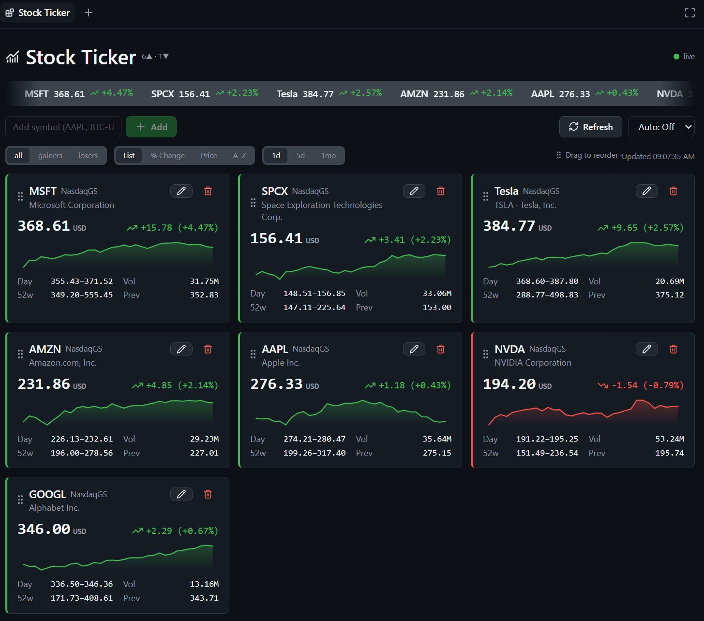
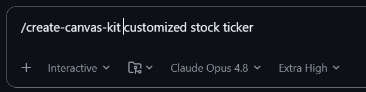

# create-canvas-kit

Build **GitHub Copilot App canvas extensions** the right way, fast — a no-build
Preact + htm kit packaged as a Copilot skill.

A canvas is an interactive side-panel surface the Copilot agent can open and
drive: dashboards, editors, trackers, boards, document previews.



> A Stock Ticker canvas built with the kit: live quote cards with sparklines,
> filter/sort tabs, and a watchlist — Primer-themed, official GitHub icons.

## Quickstart

**1. Install the skill** (global, for GitHub Copilot):

```sh
npx skills add jongio/skills --skill create-canvas-kit -g --agent github-copilot
```

**2. Reload skills** — run `/skills reload`, or start a new session.

**3. Ask Copilot to build a canvas:**

```
/create-canvas-kit build a kanban board canvas with todo / doing / done columns
```



That's it. The agent loads the skill, stamps a working canvas with the kit (live
shared state, durable storage, Primer theming, official GitHub icons), shapes it
to your request, and validates it visually before handing it back.

> No agent? Stamp one yourself in one command — see
> [Build without the agent](#build-without-the-agent).

## What you get

- **Live shared state** — the agent and the user act on the same state through
  the same action handlers; updates fan out to every open panel over SSE.
- **No keystroke loss** — Preact diffs the DOM, so live pushes never clobber
  focus or half-typed input (the #1 bug in hand-rolled `innerHTML` canvases).
- **Durable per-user storage** — state persists under
  `$COPILOT_HOME/extensions/<name>/artifacts/<domain>.json`.
- **Primer theming** — `ck-*` classes mapped to the host theme tokens with
  GitHub-dark fallbacks.
- **Official GitHub icons** — the exact Lucide set github-app ships
  (`lucide-react@1.14.0`), vendored and byte-identical.
- **A generator** — `node scripts/new-canvas.mjs <name>` stamps a working canvas
  (add `--template data` for a fetch + auto-refresh canvas) with its own smoke test.
- **Tests** — a standalone HTTP harness, a kit byte-parity check, and a generator test.

## Use it

Once installed, invoke the skill by name and describe the canvas you want:

```
/create-canvas-kit make a canvas that tracks release readiness checklist items
```

```
/create-canvas-kit a canvas to review and triage incoming webhook events
```

You don't have to name the skill explicitly — the agent routes to it whenever you
ask to "create / scaffold / build a canvas." Invoking `/create-canvas-kit` just
guarantees it.

## Install options

The Quickstart installs globally. Other ways:

```sh
# Into the current project (.agents/skills/create-canvas-kit/):
npx skills add jongio/skills --skill create-canvas-kit

# Pin to a branch or tag:
npx skills add jongio/skills#main --skill create-canvas-kit
```

Uses the [`vercel-labs/skills`](https://github.com/vercel-labs/skills) CLI
(`skills.sh`) — note the binary is **`skills`** (plural). This skill lives in the
[`jongio/skills`](https://github.com/jongio/skills) monorepo at
`skills/create-canvas-kit/`; the bundled `kit/`, `reference/`, and `test/`
directories are copied in with it.

**Copilot plugin marketplace** &mdash; install through Copilot's native plugin
system. Add the [`jongio/skills`](https://github.com/jongio/skills) repo as a
marketplace once, then install this skill from it:

```sh
copilot plugin marketplace add jongio/skills
copilot plugin install create-canvas-kit@jongio-skills
```

In the Copilot app: **Settings &rarr; Plugins &rarr; Install &#9662; &rarr; Add marketplace**,
enter `jongio/skills`, then click **Install** on `create-canvas-kit`. The
[root README](../../README.md#add-as-a-marketplace-or-install-as-a-plugin) has a
screenshot walkthrough. Or install every skill at once with
`copilot plugin install jongio/skills`.

**Local install (no network)** — clone, then run the bundled installer:

```sh
pwsh -File scripts/install-local.ps1
```

**Manual install** — copy this whole folder to
`$COPILOT_HOME/skills/create-canvas-kit/` (`~/.copilot/skills/create-canvas-kit/`
by default).

After any install, reload skills with `/skills reload` or a new session.

## Build without the agent

Prefer to drive it yourself? The generator stamps the same working canvas the
skill uses:

```sh
# A working list canvas, kit copied in for you:
node scripts/new-canvas.mjs my-board --title "My Board" --dir .github/extensions/my-board

# An external-data canvas (fetch + refresh + visibility-gated auto-refresh):
node scripts/new-canvas.mjs market-feed --template data --dir .github/extensions/market-feed
```

Reload extensions, then open the canvas (`canvasId: "my-board"`). It works out of
the box: add, toggle, and remove items, live, shared between you and the agent.
Each stamped canvas ships a `test/smoke.test.mjs` — run `node test/smoke.test.mjs`
from the canvas folder to prove its actions over real HTTP.

Then make it yours:

1. **`canvas.mjs`** — edit `createInitialState`, the action handlers, and
   `statusLine`. This file is SDK-free and holds all your logic.
2. **`web/app.mjs`** — render the shared state with Preact + htm; call
   `invoke("<action>", input)` from buttons. Keep draft inputs in `useState`.
3. **`web/index.html`** — the shell; links `/kit/theme.css` and `./app.mjs`.
4. **`extension.mjs`** — the only SDK adapter; you rarely touch it.

See **`SKILL.md`** for the full authoring contract and **`reference/decision-log/`**
for a complete worked example.

## Ship it

Built a canvas you want to keep and reuse? Drop the folder into
[`jongio/copilot-extensions`](https://github.com/jongio/copilot-extensions) — a
collection of finished, installable canvases. From there you (or anyone with
access) install one in-app by asking the agent: *"install the stock-ticker canvas
from jongio/copilot-extensions/extensions/stock-ticker."* No clone, no build.

## Layout

```
SKILL.md                      The Copilot skill (authoring contract + workflow)
kit/                          The canonical kit — copy into your extension as canvas-kit/
  client.mjs                  Browser runtime: html, mountCanvas, pollWhileVisible, hooks, Icon, formatters
  server.mjs                  SDK-free runtime: /state, /events (SSE), /action, static
  storage.mjs                 Durable per-user JSON store
  format.mjs                  nid + relativeTime / compactNumber / percent helpers
  theme.css                   Primer-token styling (ck-* classes)
  icons.mjs                   Lucide Icon component + helpers
  vendor/                     Vendored Preact+htm and the Lucide glyph data
reference/decision-log/       Complete working canvas in the real installed shape
scripts/
  new-canvas.mjs              Generator — stamp a new canvas (--template list|data)
  install-local.ps1           Install this skill into $COPILOT_HOME/skills
test/
  http.test.mjs               Boots the runtime over real HTTP and checks the contract
  kit-parity.test.mjs         Asserts kit/ == reference canvas-kit/ (no drift)
  generator.test.mjs          Stamps both templates, runs their smoke tests, checks the kit API
```

## Run the tests

```sh
node test/http.test.mjs
node test/kit-parity.test.mjs
node test/generator.test.mjs
```

No dependencies to install — everything is vendored. Node 18+ (developed on 24).

## License

MIT — see [LICENSE](./LICENSE).
